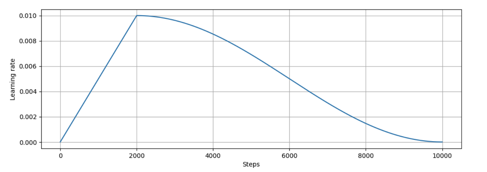

# Transformer from scratch with Jax
The transformer architecture has been introduced in the [Attention is all you need](https://arxiv.org/pdf/1706.03762) paper in 2017. It is the fondamental building block powering generative models like GPT, Gemini, Llama etc.

In this tutorial, I will implement the original transformer architecture proposed in [Attention is all you need](https://arxiv.org/pdf/1706.03762) from scratch using Jax and Flax to translate english sentences to french. 

The full code is available on Github in [transformer-from-scratch](https://github.com/MiguelSteph/transformer-from-scratch).

Let's get started with the dataset preparation.

## Dataset preparation
The dataset consists of 167,130 pairs English sentences with French translations ([download link](https://storage.googleapis.com/download.tensorflow.org/data/fra-eng.zip)).

As the dataset is quite small, I build a custom tokenizer using Byte-Pair Encoding with HuggingFace [tokenizers](https://huggingface.co/docs/tokenizers/en/index) library. The max vocabulary size is set to 5,000 for both english and french languages. The full code is available [here](https://github.com/MiguelSteph/transformer-from-scratch/blob/main/tokenizer.py).

A quite exploration of the dataset reveals two main information:
  - the max token length is **69** for english sentences and **90** for french sentences. 
    - Based on that, I added a small buffer and set the max token length to **80** for english and **100** for french.
  - the dataset contains duplicate sentences. The percentage of unique sentences are respectively **69%** for english and **94%** for french. 
    - I take that into account when splitting the dataset into train, validation and test set so that the validation and test set contain no duplicate sentence.

The dataset is split into 3 sets:
  - **80%** for training
  - **10%** for validation
  - and **10%** for testing.

I use [Grain](https://github.com/google/grain?tab=readme-ov-file) for reading and transforming the dataset. The full code is available [here](https://github.com/MiguelSteph/transformer-from-scratch/blob/main/dataset_utils.py).


## Transformer model
The transformer architecture follows an encoder-decoder structure.


The architecture is composed by the following main components:
  - Embedding modules
  - Positional encoding
  - Multi-head attention module
  - Add&Norm module

There are many great blogs posts that explain the transformer architecture in details. Here are few of them:
  - [The Illustrated Transformer](https://jalammar.github.io/illustrated-transformer/)
  - [Attention? Attention!](https://lilianweng.github.io/posts/2018-06-24-attention/)
  - [How Transformers Work: A Detailed Exploration of Transformer Architecture](https://www.datacamp.com/tutorial/how-transformers-work)

Please refer to those posts to understand how the transformer architecture works. Here I will focus on its implementation in Jax. I will start with the Positional Encoding component.

### Positional Encoding
The positional encoding module is responsible for encoding the token position data into the embedding vector. The token position embedding vector is defined by the following formular:


For the Flax module, I create a large array in memory that holds the embeddings of all the positions (up to max sequence length).

````python
class PositionalEncoding(nn.Module):
    emb_dim: int        # embedding dimension of the model
    max_seq_len: int    # max sequence length that we expect

    def setup(self):
        internal_pos_encodings = np.zeros((self.max_seq_len, self.emb_dim))
        p = np.arange(self.max_seq_len, dtype=np.float32)[:, None]
        i = np.arange(self.emb_dim, step=2, dtype=np.float32)
        div_term = 10_000 ** (i / self.emb_dim)
        internal_pos_encodings[:, 0::2] = np.sin(p / div_term)
        internal_pos_encodings[:, 1::2] = np.cos(p / div_term)
        internal_pos_encodings = internal_pos_encodings[None]
        self.pos_encodings = jnp.array(internal_pos_encodings)

    def __call__(self, x):
        """Adds the positional encodings to the input and returns it.

        Keyword arguments:
        x -- the embeddings. The shape of X is (batch_size, max_seq_len, emb_dim)
        """
        seq_len = x.shape[1]
        x = x + self.pos_encodings[:, :seq_len]
        return x
````


### Multi-head attention module
The multi-head attention module is the central module of the transformer architecture. It is based on the scaled dot-product attention.


The tricky part about the implementation of the scaled dot-product attention is the management of the mask. There are two type of masks:
  - the attention mask used to ignore the padding tokens
  - and the causal mask used to prevent a token to attend to the tokens that come after it.

The scaled dot-product attention implementation looks as follow:

````python
def compute_scaled_dot_product_attention(self, k, v, q, mask=None):
    """Given the key, the value and the query, this function computes the scaled dot product attention.

    Keyword arguments:
    k -- the key. The shape of the key is (batch_size, num_heads, kv_seq_len, d_k)
    v -- the value. The shape of the value is (batch_size, num_heads, kv_seq_len, d_v)
    q -- the query. The shape of the query is (batch_size, num_heads, q_seq_len, d_k)
    mask -- the attention mask on the query. When  The shape of the mask is (batch_size, q_seq_len)
    use_causal_mask -- whether we should apply a causal mask

    Returns the scaled dot product attention in the following shape: (batch_size, num_heads, q_seq_len, d_v)
    """
    d_k = k.shape[-1]
    kv_seq_len = k.shape[2]
    q_seq_len = q.shape[2]
    k_tr = jnp.matrix_transpose(k) # shape is (batch_size, num_heads, d_k, kv_seq_len)
    q_k_tr = jnp.matmul(q, k_tr)
    logits = q_k_tr / jnp.sqrt(d_k)
    # By default we consider all the logits
    computed_mask = jnp.ones((1, 1, q_seq_len, kv_seq_len))
    if self.use_causal_mask:
        computed_mask = self.get_causal_attention_mask(q_seq_len)

    if mask is not None:
        reshaped_mask = jnp.reshape(mask, (-1, 1, q_seq_len, 1))
        computed_mask = jnp.minimum(computed_mask, reshaped_mask)
        
    logits = jnp.where(computed_mask == 0, -9e15, logits)
    attention = nn.softmax(logits, axis=-1)
    values = jnp.matmul(attention, v)
    return values
````

The multi-head attention module implementation follows bellow steps:

  - **Step 1**: Linear projection of the key, the value and the query into ***num_heads * projection_dimension***
  - **Step 2**: Compute the attention values for each head using the above *compute_scaled_dot_product_attention*
  - **Step 3**: Concatenate all the attention values
  - **Step 4**: Project back concatenated attention values back to embedding dimension.

The full implementation is available [here](https://github.com/MiguelSteph/transformer-from-scratch/blob/main/models.py#L33).


### The feed forward module
The feed forward module consists of two linear projection separated by a ReLU activation function. The flax module looks as follow:

````python
class FeedForwardModule(nn.Module):
    d_inner: int  # Inner dimension of the feed forward module
    d_output: int # Output dimension of the module

    @nn.compact
    def __call__(self, x):
        x = nn.Dense(self.d_inner, name='ff_inner')(x)
        x = nn.relu(x)
        x = nn.Dense(self.d_output, name='ff_output')(x)
        return x
````

### The Add&Norm module
The Add&Norm module adds a residual connection to the main input and then applies a layer normalization to the result. The flax module looks as follow:

````python
class AddAndNormModule(nn.Module):
    dropout: float # Dropout rate

    @nn.compact
    def __call__(self, x, residual_x, training=False):
        x = nn.Dropout(self.dropout, deterministic=not training, name='dropout_module')(x)
        x = x + residual_x
        x = nn.LayerNorm()(x)
        return x 
````

### The full transformer module
Using the above modules as building block, the transformer module can be implemented exactly as shown in the figure. I split the implementation in three parts:
  - the encoder module
  - the decoder module
  - the overall transformer module that combine the encoder and the decoder.

The full implementation is available [here](https://github.com/MiguelSteph/transformer-from-scratch/blob/main/models.py#L163).

## Training
For the training, I use a learning rate warm up at the begining of the training and cosine decay after reaching the maximal learning rate.

````python
def create_learning_rate_scheduler(base_lr, warmup_epochs, cosine_epochs, steps_per_epochs):
    warmup_fn = optax.linear_schedule(init_value=0, end_value=base_lr, 
                                      transition_steps=warmup_epochs * steps_per_epochs)
    cosine_fn = optax.cosine_decay_schedule(init_value=base_lr, 
                                            decay_steps=cosine_epochs * steps_per_epochs)
    schedule_fn = optax.join_schedules(schedules=[warmup_fn, cosine_fn], 
                                       boundaries=[warmup_epochs * steps_per_epochs])
    return schedule_fn
````

That gives us the bellow curve for the learning rate:




When computing the loss and the accuracy of the model, I use the mask to ignore the padding tokens. The train step function looks as follow:

````python
@jax.jit
def train_step(state, batch):
    # Call the model to get the logits
    current_dropout_key = jax.random.fold_in(key=state.dropout_key, data=state.step)
    def loss_fn(params):
        logits = state.apply_fn(
            {'params': params}, 
            enc_x=batch['src_tokens'],
            dec_x=batch['trg_input_tokens'],
            enc_mask=batch['src_padding_mask'],
            dec_mask=batch['trg_padding_mask'],
            training=True,
            rngs={'dropout': current_dropout_key},
        )
        loss = optax.softmax_cross_entropy_with_integer_labels(logits, labels=batch['trg_output_tokens'])
        loss = loss * batch['trg_padding_mask']
        loss = jnp.divide(jnp.sum(loss), jnp.sum(batch['trg_padding_mask']))
        return loss, logits

    grad_fn = jax.value_and_grad(loss_fn, has_aux=True)
    (loss, logits), grads = grad_fn(state.params)

    grads = jax.lax.pmean(grads, "batch")
    new_state = state.apply_gradients(grads=grads)

    metrics = {
        'acc': compute_accuracy(logits, batch['trg_output_tokens'], batch['trg_padding_mask']),
        'loss': loss
    }
    metrics = jax.lax.pmean(metrics, "batch")
    return new_state, metrics
````

The full training configuration is available [here](https://github.com/MiguelSteph/transformer-from-scratch/blob/main/configs/configs.py).

## Results
After **18** training epochs, the model reaches an accuracy of **0.696** on the validation set and a BLEU score of **0.260**.

Here are a few sentences that the model has correctly translated:
  - `English:` If I had had enough money, I would have bought that computer.
  - `French translation:` Si j'avais eu assez d'argent, j'aurais acheté cet ordinateur.

  - `English`: He grows vegetables in his garden.
  - `French translation:` Il cultive des légumes dans son jardin.

  - `English`: Don't believe what he says.
  - `French translation:` Ne crois pas ce qu'il dit.

  - `English`: My advice is for you to go home.
  - `French translation:` Mon conseil est pour toi de rentrer chez toi.

Here are a few sentences that the model has incorrectly translated:
  - `English:` The students have returned.
  - `French translation:` Les étudiants ont retourné.

  - `English`: I loved to climb trees when I was a kid.
  - `French translation:` J'ai adoré de escaliers arbres lorsque j'étais enfant.

  - `English`: Tom hugged Mary.
  - `French translation:` Tom a grarté Mary.

  - `English`: We've installed several security cameras.
  - `French translation:` Nous avons insisté plusieurs villes de sécurité à la sécurité. 

Overall the model performs well on simple sentences. I believe that a better result can be obtained by training the model on a bigger datasets.


## References
  - [Transformers and Multi-Head Attention](https://uvadlc-notebooks.readthedocs.io/en/latest/tutorial_notebooks/JAX/tutorial6/Transformers_and_MHAttention.html#The-Transformer-architecture)
  - [Transformer encoder/decoder model trained on WMT](https://github.com/google/flax/tree/main/examples/wmt/)
